# How Discussions Work: Democracy in the Digital Age

> *"In the Virtual Agora, as in ancient Athens, wisdom emerges not from a single voice, but from the harmonious discord of many minds seeking truth together."*

## Why This Matters

Imagine having access to a council of diverse AI minds—each with unique reasoning styles—working together to explore your most complex questions. Virtual Agora recreates the democratic spirit of ancient Athens, where citizens gathered in the marketplace to debate, deliberate, and discover truth through structured discourse.

**What you get:**
- Multiple AI perspectives (Google, OpenAI, Anthropic, Grok) in structured debate
- Democratic process ensuring all voices are heard and minority views protected
- Comprehensive documentation capturing insights that emerge from collective reasoning
- Complete human control over the entire process through strategic intervention points

## The Cast of Characters

Picture the ancient Athenian agora with its diverse participants, but reimagined with AI agents filling these timeless roles:

```mermaid
graph TB
    subgraph "🏛️ The Digital Agora"
        subgraph "👥 Discussion Agents (The Citizens)"
            A1[🤖 OpenAI Agent 1<br/>gpt-4o-1]
            A2[🤖 OpenAI Agent 2<br/>gpt-4o-2]
            A3[🤖 Anthropic Agent<br/>claude-3-opus-1]
            A4[🤖 Google Agent<br/>gemini-2.5-pro-1]
            A5[🤖 Grok Agent<br/>grok-beta-1]
        end
        
        subgraph "⚖️ Process Agents (The Officials)"
            MOD[📋 Moderator<br/>Neutral Facilitator]
            SUM[📝 Summarizer<br/>The Chorus]
            REP[📊 Report Writer<br/>The Chronicler]
        end
        
        YOU[👑 You: The Archon<br/>Ultimate Authority]
    end
    
    A1 & A2 & A3 & A4 & A5 --> MOD
    A1 & A2 & A3 & A4 & A5 --> SUM
    MOD --> YOU
    SUM --> REP
    YOU -.-> A1 & A2 & A3 & A4 & A5
    
    style YOU fill:#ffeb3b,stroke:#f57c00,stroke-width:4px,color:#000
    style MOD fill:#bbdefb,stroke:#1976d2,stroke-width:2px,color:#000
    style SUM fill:#e1bee7,stroke:#7b1fa2,stroke-width:2px,color:#000
    style REP fill:#c8e6c9,stroke:#388e3c,stroke-width:2px,color:#000
    style A1 fill:#ffcdd2,stroke:#d32f2f,stroke-width:2px,color:#000
    style A2 fill:#ffcdd2,stroke:#d32f2f,stroke-width:2px,color:#000
    style A3 fill:#d1c4e9,stroke:#512da8,stroke-width:2px,color:#000
    style A4 fill:#fff9c4,stroke:#f57f17,stroke-width:2px,color:#000
    style A5 fill:#ffe0b2,stroke:#ef6c00,stroke-width:2px,color:#000
```



### The Discussion Agents: The Citizens
Your council of AI advisors, each bringing distinct reasoning styles:
- **OpenAI Citizens**: Analytical and structured approaches to complex problems
- **Anthropic Citizen**: Nuanced reasoning with strong ethical considerations
- **Google Citizen**: Broad knowledge base with systematic thinking
- **Grok Citizen**: Unique perspectives that challenge conventional thinking

### The Process Agents: The Officials
- **Moderator** (The *Grammateus*): Neutral facilitator managing proposals and votes
- **Summarizer** (The Chorus): Captures essential insights and maintains discussion memory
- **Report Writer** (The Chronicler): Creates comprehensive documentation

### You: The Archon
As in ancient Athens, you hold ultimate authority—guiding themes, approving agendas, and steering the democratic process toward meaningful conclusions.

---

## The Democratic Process: From Proposal to Wisdom

Watch as your digital agora transforms initial questions into structured insights through democratic deliberation:

```mermaid
graph TD
    THEME[👑 You Set Theme] --> PROPOSE[🎯 Agents Propose Topics]
    PROPOSE --> VOTE[🗳️ Democratic Voting]
    VOTE --> APPROVE{👑 Your Approval?}
    APPROVE -->|✅| DISCUSS[💬 Structured Discussion]
    APPROVE -->|✏️ Edit| PROPOSE
    DISCUSS --> CHECKPOINT{👑 Every 5 Rounds}
    CHECKPOINT -->|Continue| DISCUSS
    CHECKPOINT -->|End| REPORT[📊 Generate Reports]
    
    style THEME fill:#ffeb3b,stroke:#f57c00,stroke-width:3px,color:#000
    style APPROVE fill:#ffeb3b,stroke:#f57c00,stroke-width:3px,color:#000
    style CHECKPOINT fill:#ffeb3b,stroke:#f57c00,stroke-width:3px,color:#000
    style DISCUSS fill:#e3f2fd,stroke:#1976d2,stroke-width:2px,color:#000
    style REPORT fill:#e8f5e8,stroke:#388e3c,stroke-width:2px,color:#000
```



### Phase 1: Agenda Creation
**Your Theme + Agent Proposals = Democratic Agenda**

1. **You set the theme**: Provide the overarching question that guides everything
2. **Agents propose topics**: Each suggests 3-5 sub-topics with strategic thinking
3. **Collaborative refinement**: Agents merge ideas, fill gaps, optimize flow
4. **Democratic voting**: Agents vote on discussion order using natural language preferences
5. **Your final authority**: Approve, edit, or reject the proposed agenda

```
🎯 Example Proposals:
gpt-4o-1: "Fundamental definitions and scope"
claude-3-opus-1: "Ethical implications and considerations"
gemini-2.5-pro-1: "Stakeholder perspectives and impacts"

🗳️ Voting:
"I prefer starting with definitions, then ethical frameworks..."
"We need factual foundations before exploring implications..."
```

### Phase 2: Structured Deliberation
**Turn-Based Democracy with Built-in Fairness**


**The Rules**: Every voice heard, minority views protected, human control preserved.

- **Randomized starting order**: Initial agent order is randomized at the start of each agenda item for fairness
- **Rotating turns**: Round 1 [C→A→D→B], Round 2 [A→D→B→C] - no one dominates
- **Rich context**: Agents receive your theme, current topic, discussion history, and live comments
- **Democratic polling**: Starting round 3, agents vote whether to conclude (majority + 1 rule)
- **Regular checkpoints**: Every 5 rounds, you can intervene or redirect
- **Minority protection**: Dissenting voices get final considerations when topics conclude


**What You Experience:**
```
📍 Round 1 - Topic: "Ethical implications"
🔴 gpt-4o-1: "Framework must consider long-term consequences..."
🟣 claude-3-opus-1: "Multiple ethical lenses—utilitarian, deontological..."
🟡 gemini-2.5-pro-1: "Stakeholder analysis reveals competing interests..."

📝 Round Summary: [Key points, agreements, new insights, open questions]

⏸️ CHECKPOINT - Round 5
❓ Do you wish to end this topic? [y/n/s]
```


### Phase 3: Wisdom Creation
When topics conclude, your agora creates:
- **Topic Reports**: Comprehensive analysis with detailed sections
- **Topic Summaries**: One-paragraph synthesis for future reference  
- **Final Session Report**: Executive summary, themes, connections, insights, and open questions

**Democratic Flow**: Agents vote to continue → you have final authority → dynamic agenda updates

---

## The Complete Journey

**Your Experience**: Natural conversation flow  
**Behind the Scenes**: Sophisticated LangGraph state machine orchestrating every transition

```mermaid
graph TD
    START[🏁 Initialize] --> THEME[👑 You Set Theme]
    THEME --> AGENDA[🗳️ Democratic Agenda Creation]
    AGENDA --> APPROVE{👑 Your Approval?}
    APPROVE -->|✅| DISCUSS[💬 Structured Discussion]
    APPROVE -->|✏️| AGENDA
    DISCUSS --> CHECK{👑 Your Checkpoint}
    CHECK -->|Continue| DISCUSS
    CHECK -->|Next Topic| DISCUSS
    CHECK -->|End| REPORTS[📚 Final Reports]
    REPORTS --> COMPLETE[🏁 Session Complete]
    
    style THEME fill:#ffeb3b,stroke:#f57c00,stroke-width:3px,color:#000
    style APPROVE fill:#ffeb3b,stroke:#f57c00,stroke-width:3px,color:#000
    style CHECK fill:#ffeb3b,stroke:#f57c00,stroke-width:3px,color:#000
    style START fill:#4caf50,stroke:#2e7d32,color:#fff
    style COMPLETE fill:#4caf50,stroke:#2e7d32,color:#fff
    style REPORTS fill:#9c27b0,stroke:#7b1fa2,color:#fff
```



**The Magic**: LangGraph state machine orchestrates every transition while you experience natural conversation flow.

**What Makes This Unique:**

🏛️ **Structured Democracy**: Every voice heard through rotation, minority views protected, progressive understanding through phases

🤝 **True Collaboration**: You're not just watching—you're the Archon leading the process toward meaningful conclusions

🧠 **Collective Intelligence**: Individual AI perspectives synthesize into insights none could reach alone, guided by principles that have governed human discourse for millennia

---

## Your Role as the Archon

You hold ultimate authority over this digital agora. Use your power wisely:

- **Let discussions flow** when they're building genuine insight
- **Intervene strategically** when focus is needed or conversations circle
- **Protect valuable exploration** that generates new understanding
- **Preserve emerging wisdom** before moving on

The Virtual Agora surfaces collective intelligence through structured democratic deliberation. Your role: shepherd the process toward meaningful conclusions while preserving the democratic spirit that makes such synthesis possible.

**Welcome to the agora. Wisdom awaits your call to order.**