# How Discussions Work: Democracy in the Digital Age

> *"In the Virtual Agora, as in ancient Athens, wisdom emerges not from a single voice, but from the harmonious discord of many minds seeking truth together."*

## Why This Matters

Imagine having access to a council of diverse AI minds—each with unique reasoning styles—working together to explore your most complex questions. Virtual Agora recreates the democratic spirit of ancient Athens, where citizens gathered in the marketplace to debate, deliberate, and discover truth through structured discourse.

**What you get:**
- Multiple AI perspectives (Google, OpenAI, Anthropic, Grok) in structured debate
- Democratic process ensuring all voices are heard and minority views protected
- Comprehensive documentation capturing insights that emerge from collective reasoning
- Complete human control over the entire process through strategic intervention points

## The Cast of Characters

Picture the ancient Athenian agora with its diverse participants, but reimagined with AI agents filling these timeless roles:

```mermaid
graph TB
    subgraph "🏛️ The Digital Agora"
        subgraph "👥 Discussion Agents (The Citizens)"
            A1[🤖 OpenAI Agent 1<br/>gpt-4o-1]
            A2[🤖 OpenAI Agent 2<br/>gpt-4o-2]
            A3[🤖 Anthropic Agent<br/>claude-3-opus-1]
            A4[🤖 Google Agent<br/>gemini-2.5-pro-1]
            A5[🤖 Grok Agent<br/>grok-beta-1]
        end
        
        subgraph "⚖️ Process Agents (The Officials)"
            MOD[📋 Moderator<br/>Neutral Facilitator]
            SUM[📝 Summarizer<br/>The Chorus]
            REP[📊 Report Writer<br/>The Chronicler]
        end
        
        YOU[🎯 You: The Round Moderator<br/>Strategic Guide]
    end
    
    A1 & A2 & A3 & A4 & A5 --> MOD
    A1 & A2 & A3 & A4 & A5 --> SUM
    MOD --> YOU
    SUM --> REP
    YOU -.-> A1 & A2 & A3 & A4 & A5
    
    style YOU fill:#ffeb3b,stroke:#f57c00,stroke-width:4px,color:#000
    style MOD fill:#bbdefb,stroke:#1976d2,stroke-width:2px,color:#000
    style SUM fill:#e1bee7,stroke:#7b1fa2,stroke-width:2px,color:#000
    style REP fill:#c8e6c9,stroke:#388e3c,stroke-width:2px,color:#000
    style A1 fill:#ffcdd2,stroke:#d32f2f,stroke-width:2px,color:#000
    style A2 fill:#ffcdd2,stroke:#d32f2f,stroke-width:2px,color:#000
    style A3 fill:#d1c4e9,stroke:#512da8,stroke-width:2px,color:#000
    style A4 fill:#fff9c4,stroke:#f57f17,stroke-width:2px,color:#000
    style A5 fill:#ffe0b2,stroke:#ef6c00,stroke-width:2px,color:#000
```



### The Discussion Agents: The Citizens
Your council of AI advisors, each bringing distinct reasoning styles:
- **OpenAI Citizens**: Analytical and structured approaches to complex problems
- **Anthropic Citizen**: Nuanced reasoning with strong ethical considerations
- **Google Citizen**: Broad knowledge base with systematic thinking
- **Grok Citizen**: Unique perspectives that challenge conventional thinking

### The Process Agents: The Officials
- **Moderator** (The *Grammateus*): Neutral facilitator managing proposals and votes
- **Summarizer** (The Chorus): Captures essential insights and maintains discussion memory
- **Report Writer** (The Chronicler): Creates comprehensive documentation

### You: The Round Moderator
You guide the discussion flow between rounds, reviewing what was discussed and deciding how to proceed. Like a skillful moderator, you have strategic moments to shape the direction while preserving the democratic spirit of the debate.

---

## The Democratic Process: From Proposal to Wisdom

Watch as your digital agora transforms initial questions into structured insights through democratic deliberation:

```mermaid
graph TD
    THEME[🎯 You Set Theme] --> PROPOSE[🎯 Agents Propose Topics]
    PROPOSE --> VOTE[🗳️ Democratic Voting]
    VOTE --> APPROVE{🎯 Your Approval?}
    APPROVE -->|✅| ROUND[💬 Discussion Round]
    APPROVE -->|✏️ Edit| PROPOSE
    ROUND --> SUMMARY[📝 Round Summary]
    SUMMARY --> MODERATE{🎯 Your Moderation}
    MODERATE -->|Participate| ROUND
    MODERATE -->|Continue| ROUND
    MODERATE -->|End Topic| CONCLUSION[🗳️ Topic Conclusion]
    CONCLUSION --> REPORT[📊 Generate Reports]
    
    style THEME fill:#ffeb3b,stroke:#f57c00,stroke-width:3px,color:#000
    style APPROVE fill:#ffeb3b,stroke:#f57c00,stroke-width:3px,color:#000
    style MODERATE fill:#ffeb3b,stroke:#f57c00,stroke-width:3px,color:#000
    style ROUND fill:#e3f2fd,stroke:#1976d2,stroke-width:2px,color:#000
    style SUMMARY fill:#f3e5f5,stroke:#7b1fa2,stroke-width:2px,color:#000
    style REPORT fill:#e8f5e8,stroke:#388e3c,stroke-width:2px,color:#000
```



### Phase 1: Agenda Creation
**Your Theme + Agent Proposals = Democratic Agenda**

1. **You set the theme**: Provide the overarching question that guides everything
2. **Agents propose topics**: Each suggests 3-5 sub-topics with strategic thinking
3. **Collaborative refinement**: Agents merge ideas, fill gaps, optimize flow
4. **Democratic voting**: Agents vote on discussion order using natural language preferences
5. **Your final authority**: Approve, edit, or reject the proposed agenda

```
🎯 Example Proposals:
gpt-4o-1: "Fundamental definitions and scope"
claude-3-opus-1: "Ethical implications and considerations"
gemini-2.5-pro-1: "Stakeholder perspectives and impacts"

🗳️ Voting:
"I prefer starting with definitions, then ethical frameworks..."
"We need factual foundations before exploring implications..."
```

### Phase 2: Round-Based Discussion with Moderation
**You Guide the Flow Between Rounds**

**The New Experience**: Agents discuss → Round ends → You see summary → You decide next steps.

**How It Works:**
- **Discussion Rounds**: Agents take turns in rotating order (Agent A → Agent B → Agent C)
- **Round Summaries**: After each round, you see what was discussed and where it's headed
- **Your Moderation**: Between every round, you choose how to proceed
- **Democratic Elements**: Agents can vote to conclude (you can override), minority views protected

**Your Three Options Each Round:**
- **🗣️ Participate**: Add your thoughts/questions to guide the next round
- **➡️ Continue**: Let agents proceed with their current trajectory  
- **🏁 End Topic**: Move to conclusion and voting

**What You Experience:**
```
📍 Round 1 - Topic: "Is the earth flat?"
🔴 Agent A: "Evidence shows curvature through ship observations..."
🟣 Agent B: "Satellite imagery confirms spherical shape..."
🟡 Agent C: "But we should address flat earth counter-arguments..."

📝 Round 1 Summary:
• Strong evidence presented for spherical earth
• Focus on observable phenomena (ships, satellites)
• Agent C suggests addressing counter-arguments
• Emerging direction: Need systematic counter-argument analysis

🎯 Your Turn - Choose Next Steps:
□ Participate: Add your perspective to guide Round 2
□ Continue: Let agents explore counter-arguments naturally  
□ End Topic: Move to conclusion voting

You choose: "Let's focus on the strongest flat earth claims first"

📍 Round 2 - Topic continues with your guidance...
```


### Your Role as Round Moderator

**Strategic Guidance Between Rounds**: You're not just watching—you're actively shaping the discussion flow.

**What Makes This Powerful:**
- **Rich Context**: Every summary shows key points, agreements, disagreements, and emerging directions
- **Strategic Timing**: Perfect moments to inject questions, redirect focus, or let discussion flow
- **Democratic Balance**: You guide without controlling—agents maintain their autonomy and democratic spirit

**When to Participate:**
- **Inject Questions**: "What about the economic implications?"
- **Redirect Focus**: "Let's dig deeper into the ethical concerns"
- **Challenge Assumptions**: "Has anyone considered the opposite view?"
- **Synthesize**: "I'm hearing two main camps—how do we bridge them?"

**When to Continue:**
- Discussion is building momentum naturally
- Agents are exploring valuable tangents
- Democratic process is working well
- You want to see where they take it

**When to End Topic:**
- Key points have been thoroughly explored
- Discussion is becoming circular
- Time to move to next agenda item
- Ready for formal conclusion

### Enhanced Democratic Voting

**Agent Voting + Your Authority**: Starting from Round 3, agents can vote to conclude topics. You have the final say.

**Your Override Powers:**
- **Approve Agent Vote**: "Yes, we've covered this thoroughly"
- **Override to Continue**: "I think we need to explore X more deeply"  
- **Add Guidance**: "Let's do one more round focusing on Y"

### Phase 3: Wisdom Creation
When topics conclude, your agora creates:
- **Topic Reports**: Comprehensive analysis with detailed sections
- **Topic Summaries**: One-paragraph synthesis for future reference  
- **Final Session Report**: Executive summary, themes, connections, insights, and open questions

**Enhanced Flow**: Agents discuss → Round summary → Your moderation → Continue/End → Democratic voting with your oversight

---

## The Complete Journey

**Your Experience**: Natural round moderation flow  
**Behind the Scenes**: Sophisticated LangGraph state machine orchestrating every transition

```mermaid
graph TD
    START[🏁 Initialize] --> THEME[🎯 You Set Theme]
    THEME --> AGENDA[🗳️ Democratic Agenda Creation]
    AGENDA --> APPROVE{🎯 Your Approval?}
    APPROVE -->|✅| ROUND[💬 Discussion Round]
    APPROVE -->|✏️| AGENDA
    ROUND --> SUMMARY[📝 Round Summary]
    SUMMARY --> MODERATE{🎯 Your Moderation}
    MODERATE -->|Participate| ROUND
    MODERATE -->|Continue| ROUND
    MODERATE -->|End Topic| VOTE[🗳️ Topic Conclusion]
    VOTE --> REPORTS[📚 Final Reports]
    REPORTS --> COMPLETE[🏁 Session Complete]
    
    style THEME fill:#ffeb3b,stroke:#f57c00,stroke-width:3px,color:#000
    style APPROVE fill:#ffeb3b,stroke:#f57c00,stroke-width:3px,color:#000
    style MODERATE fill:#ffeb3b,stroke:#f57c00,stroke-width:3px,color:#000
    style START fill:#4caf50,stroke:#2e7d32,color:#fff
    style COMPLETE fill:#4caf50,stroke:#2e7d32,color:#fff
    style SUMMARY fill:#f3e5f5,stroke:#7b1fa2,stroke-width:2px,color:#000
    style REPORTS fill:#9c27b0,stroke:#7b1fa2,color:#fff
```



**The Magic**: LangGraph state machine orchestrates every transition while you experience natural moderation flow.

**What Makes This Unique:**

🏛️ **Structured Democracy**: Every voice heard through rotation, minority views protected, strategic moderation points

🎯 **Strategic Moderation**: You guide the flow between rounds with rich summaries and clear options—participate, continue, or conclude

🧠 **Collective Intelligence**: Individual AI perspectives synthesize into insights none could reach alone, enhanced by your strategic guidance at perfect moments

---

## Your Role as the Round Moderator

You guide this digital agora through strategic moderation between rounds. Use your moments wisely:

- **Let discussions flow** when agents are building genuine insight naturally
- **Participate strategically** when your perspective can advance understanding
- **Guide focus** when conversations need direction or are becoming circular
- **Preserve emerging wisdom** by knowing when topics are ready for conclusion

The Virtual Agora surfaces collective intelligence through structured democratic deliberation enhanced by human moderation. Your role: provide strategic guidance at perfect moments while preserving the democratic spirit that makes such synthesis possible.

**Welcome to the agora. Wisdom awaits your moderation.**