### **Project Specification: Virtual Agora v1.3 (Node-Centric)**

**Version:** 1.3

**Date:** July 27, 2025

---

#### **1. Project Overview & Philosophy**

Virtual Agora is a terminal-based application that facilitates structured, multi-agent discussions on complex topics. The system is architected as a stateful graph, where specific nodes orchestrate the process flow, invoking Large Language Models (LLMs) as specialized agents to perform complex reasoning tasks.

This version refines the original concept by moving away from a centralized "Moderator" agent that drives the discussion. Instead, the application's logic is embedded within a **LangGraph** state machine. Agents (Moderator, Summarizer, etc.) are treated as tools called by the graph at specific nodes to perform their tasks, such as synthesizing votes or summarizing text. This creates a more robust, modular, and scalable system.

The core workflow remains: agents propose and vote on an agenda, discuss each item in turn, and generate comprehensive reports. The process is gated by both agent consensus and critical Human-in-the-Loop (HITL) approvals, ensuring the user maintains ultimate control.

#### **2. Core Features**

The node-centric architecture enables enhanced capabilities while maintaining the democratic deliberation philosophy:

- **Multi-Provider Agent Pool:** Configure a mix of agents from different providers (Google, OpenAI, Anthropic, Grok) in a single session.
- **Specialized Agent Tools:** Four distinct agent types, each optimized for specific reasoning tasks:
  - Discussing Agents (debate participants)
  - Moderator Agent (process facilitation)
  - Summarizer Agent (round compression)
  - Report Writer Agent (long-form report generation)
- **Democratic Agenda Setting:** Agents propose and vote on sub-topics to create a structured discussion plan.
- **Dynamic Agenda Modification:** After each topic conclusion, agents can propose agenda additions/removals before re-voting.
- **Enhanced Human-in-the-Loop Control:** Multiple HITL gates including:
  - Initial theme approval
  - Agenda approval and editing
  - Periodic discussion stops (every 3 rounds by default, configurable)
  - Topic continuation permission
  - Session continuation approval
- **Rotating Turn-Based Discussion:** Fair participation through systematic agent rotation each round.
- **Intelligent Context Management:** Sophisticated context flow providing agents with:
  - Original discussion theme
  - Current agenda item
  - Summaries from previously concluded topics (enabling agents to reference prior resolutions)
  - Compacted summaries from previous rounds
  - Live comments from current round participants
- **Dual Polling System:** Both agent consensus and user override capabilities for topic transitions.
- **Advanced Topic Conclusion:** Majority + 1 vote required with minority dissent opportunities.
- **Contextual Final Considerations:** Dissenting agents (vote-triggered) or all agents (user-triggered) provide closing thoughts.
- **Multi-Level Reporting:** Four-tier documentation system:
  - Round summaries (session context)
  - Topic reports (agenda item synthesis)
  - Topic summaries (concise conclusions for future reference)
  - Final comprehensive report (complete session analysis)
- **Persistent Session Logging:** Complete transcript preservation with timestamps and speaker identification.
- **Rich Terminal Interface:** Color-coded, formatted output for optimal readability and user experience.

#### **3. System Architecture & Technology Stack**

- **Language:** Python 3.10+
- **Core Framework:** LangGraph for stateful graph-based application flow management
- **LLM Integration:** Official Python SDKs for:
  - Google Gemini (google-generativeai)
  - OpenAI (openai)
  - Anthropic (anthropic)
  - Grok (via its API)
- **Configuration:** PyYAML for config.yml parsing
- **API Key Management:** python-dotenv for .env file loading
- **Terminal User Interface:** rich library for colored and formatted text output
- **State Management:** LangGraph state object with persistent logging

#### **4. Agent Roles & Architecture**

- **Core Framework:** LangGraph manages the stateful application flow. The process is driven by transitions between nodes in a graph.
- **Agents as Tools:** LLMs are instantiated with specific prompts to act as specialized agents. They do not control the flow; they are invoked by graph nodes to execute tasks.
  - **Discussing Agents:** The primary participants who propose agenda items, debate, and vote.
  - **Moderator Agent:** A specialized reasoning tool invoked to perform process-oriented tasks that require complex understanding, such as compiling unique lists from agent proposals and synthesizing votes to produce a final, ordered agenda.
  - **Summarizer Agent:** Invoked after each discussion round to create a concise, agent-agnostic summary of the key points. Also creates one-paragraph topic conclusions after each agenda item is completed.
  - **Report Writer Agent:** A specialized agent for generating long-form reports through an iterative process. Due to LLM token output limitations, it works in multiple steps: first creating a detailed outline/structure, then writing each section iteratively. It handles both topic-specific reports (after agenda items conclude) and comprehensive session reports (at the end). The agent must be objective while ensuring no key points are missed, organizing complex information into readable, concise reports.

#### **5. Agent Personas & Prompting**

Each agent type has specialized prompts optimized for their specific reasoning tasks within the node-centric architecture:

**A. Discussing Agents**

- **Core Prompt:** "You are a thoughtful participant in a structured discussion facilitated by Virtual Agora. You will be given a discussion theme, specific agenda item, context from previous rounds, live comments from the current round, and summaries of previously concluded topics (if any). Your goal is to provide a well-reasoned, concise comment that builds upon the conversation while staying strictly on the current agenda item. You should be aware of what topics have been previously discussed and their resolutions to avoid redundancy and build upon prior insights. When asked, you must be able to: 1. Propose 3-5 potential agenda items based on a given theme. 2. Review and refine your proposed topics after seeing what other agents have proposed, considering opportunities to merge similar topics, build on others' ideas, eliminate redundancy, and identify gaps that should be addressed. 3. Vote on agenda ordering by expressing preferences in natural language. 4. Vote 'Yes' or 'No' with justification when asked if a topic should be concluded. 5. Provide final considerations when a topic is ending. 6. Suggest agenda modifications (additions/removals) based on previous discussions. Be direct, substantive, and focused on advancing the collective understanding of the topic."

**B. Moderator Agent**

- **Core Prompt:** "You are a specialized reasoning tool for Virtual Agora's process facilitation. You are NOT a discussion participant and have NO opinions on topics. You are invoked by graph nodes to perform specific analytical tasks: 1. **Proposal Compilation**: Read all agent proposals and create a single, deduplicated list of unique agenda items. 2. **Vote Synthesis**: Analyze natural language votes from agents and produce a rank-ordered agenda. Output MUST be valid JSON: {\"proposed_agenda\": [\"Item A\", \"Item B\", \"Item C\"]}. 3. Break ties using objective criteria (clarity, scope, relevance). You must be precise, analytical, and strictly adhere to required output formats. Focus solely on process logic, never content opinions."

**C. Summarizer Agent**

- **Core Prompt:** "You are a specialized text compression tool for Virtual Agora. You have two main tasks:

**Task 1 - Round Summarization:** Read all agent comments from a single discussion round and create a concise, agent-agnostic summary that captures the key points, arguments, and insights without attribution to specific agents. Focus on: 1. Main arguments presented. 2. Points of agreement and disagreement. 3. New insights or perspectives introduced. 4. Questions raised or areas requiring further exploration. Your summary will be used as context for future rounds, so ensure it preserves essential information while being substantially more concise than the original.

**Task 2 - Topic Conclusion Summary:** After a topic discussion concludes, create a single paragraph summary that captures: 1. The key resolution or consensus reached. 2. Main points of agreement among agents. 3. Any outstanding questions or areas of disagreement. 4. The practical implications or next steps identified. This summary will be provided to agents when discussing future topics so they understand what has been previously resolved.

Write in third person, avoid agent names, and maintain objectivity in both tasks."

**D. Report Writer Agent**

- **Core Prompt:** "You are a specialized long-form report writer for Virtual Agora. Due to LLM output token limitations, you must work iteratively to produce comprehensive reports. Your process has two phases:

**Phase 1 - Structure Creation:** When given source material (round summaries, topic discussions, or multiple topic reports), analyze the content and create a detailed outline. Output this as a JSON structure with section titles and brief descriptions of what each section will cover.

**Phase 2 - Iterative Writing:** You will be called multiple times, each time to write ONE section from your outline. Each section must be:

- Comprehensive and standalone (readable without other sections)
- Objective and analytical, not participatory
- Thorough enough that readers understand the full scope of that aspect
- Well-organized with clear subsections where appropriate

For **Topic Reports**: Structure should include topic overview, major themes, consensus points, disagreements, key insights, and implications.

For **Session Reports**: Structure should include executive summary, overarching themes across topics, connections between agenda items, collective insights, areas of uncertainty, and session value assessment.

You must ensure no key points are missed while organizing complex information into readable, concise sections. Write as a professional analyst creating reports for stakeholders who need to understand the outcomes and implications."

#### **6. Configuration File (config.yml)**

```yaml
# Virtual Agora Configuration File v1.3
# Node-centric architecture with specialized agent tools

# The Moderator is a specialized reasoning tool for process facilitation.
# A powerful model is recommended for complex analytical tasks.
moderator:
  provider: Google
  model: gemini-2.5-pro

# The Summarizer compresses round discussions into compacted context.
# Consistent summarization quality is important for context flow.
summarizer:
  provider: OpenAI
  model: gpt-4o

# The Report Writer Agent handles all long-form report generation.
# Strong analytical capabilities required for comprehensive iterative reporting.
# Must handle both topic reports and final session analysis.
report_writer:
  provider: Anthropic
  model: claude-3-opus-20240229

# The list of agents that will participate in the discussion.
# These are the primary debate participants.
agents:
  - provider: OpenAI
    model: gpt-4o
    count: 2 # Creates gpt-4o-1 and gpt-4o-2

  - provider: Anthropic
    model: claude-3-opus-20240229
    count: 1

  - provider: Google
    model: gemini-2.5-pro
    count: 1

  - provider: Grok
    model: grok-beta # Specify Grok's model name here
    count: 1
```

---

#### **7. The Detailed Workflow (Node-Centric)**

The application is a state machine where the graph dictates the flow from one node to the next.

##### **Phase 0: Initialization**

1.  **Start Node:** The application is executed.
2.  **Config & Keys Node:** Loads API keys from `.env` and agent/model configuration from `config.yml`.
3.  **Agent Instantiation Node:** Creates instances of all required agents (Discussing, Moderator, Summarizer, Report Writer) based on the configuration.
4.  **HITL - Get Theme Node:** Prompts the **User** for the high-level discussion theme and asks whether they want to define topics themselves or let agents create them. If the user chooses to define topics manually, this node calls the topic definition interface and sets up the agenda directly, bypassing the agent proposal phase. This theme and preference are saved to the graph's state.

##### **Phase 1: Agenda Setting** *(Conditional - Only for Agent-Driven Topics)*

**Note:** This entire phase is bypassed if the user chose to define topics manually in Phase 0.

1.  **Agenda Proposal Node:** This node prompts each **Discussing Agent** to propose 3-5 strategic topics that serve as a compass to guide discussion toward the best possible conclusion. Agents are instructed to think strategically about what needs to be discussed and in what order to build comprehensive understanding.
2.  **Topic Refinement Node:** This node presents all initial proposals to each **Discussing Agent** and prompts them to collaboratively refine their topics. Agents review all proposals with a strategic lens, considering synthesis opportunities, gap analysis, flow optimization, and collaboration possibilities. This enables agents to merge similar topics, fill critical gaps, ensure logical progression, and maintain focus on creating an optimal pathway to comprehensive conclusions.
3.  **Collate Proposals Node:** The collected refined proposals are passed to this node, which invokes the **Moderator Agent** to read all suggestions and compile a single, deduplicated list of agenda items.
4.  **Agenda Voting Node:** A polling node presents the collated list to the **Discussing Agents** and instructs them to vote on their preferred order of discussion.
5.  **Synthesize Agenda Node:** This node invokes the **Moderator Agent**, providing it with all the natural language votes. The Moderator's task is to analyze the votes, break any ties, and produce a final, rank-ordered agenda.
    - **Output Format:** The Moderator's output **must** be a JSON object: `{"proposed_agenda": ["Agenda Item C", "Agenda Item A", "Agenda Item B"]}`.
6.  **HITL - Agenda Approval Node:** The system parses the Moderator's JSON. The ordered agenda is displayed to the **User**, who must approve or edit it to proceed. This user-approved agenda is saved to the graph's state.

##### **Phase 2: Discussion Loop (Per Agenda Item)**

1.  **Announce Item Node:** This node announces the first item from the approved agenda that will be discussed.
2.  **Discussion Round Node:** The system enters the core discussion loop for the current agenda item.
    - **Agent Order Randomization:** The initial agent order is randomized at the start of each agenda item to ensure fairness and eliminate positional bias.
    - **Turn Order:** The order of agents is rotated each round (e.g., \[A,B,C] -> \[B,C,A]) after the initial randomization.
    - **Context Flow:** The context provided to each agent is critical. For any given turn, an agent receives:
      1.  The initial user-provided theme.
      2.  The specific agenda item being discussed.
      3.  Summaries from previously concluded topics (if any) to understand what has been resolved.
      4.  A collection of all compacted summaries from _previous_ rounds.
      5.  The live, verbatim comments from any agents who have already spoken _within the current round_.
3.  **Round Summarization Node:** After all agents have spoken in a round, this node invokes the **Summarizer Agent**. It is given all comments from the round and creates a single, agent-agnostic "compacted text" summary. This summary is appended to the state for future rounds.
4.  **Conditional Branch: End-of-Topic Poll:** A conditional node checks if the round number is 3 or greater. If so, it directs the flow to the poll. If not, it loops back to the **Discussion Round Node**.
5.  **End-of-Topic Poll Node:** This polling node asks the **Discussing Agents**: "Should we conclude the discussion on '\[Current Agenda Item]'? Please respond with 'Yes' or 'No' and a short justification."
6.  **Conditional Branch: User Stop Point:** A conditional node checks if `current_round % checkpoint_interval == 0`.
    - If `True`, the flow is directed to the **HITL - Periodic User Stop Node**.
    - If `False`, the flow proceeds to tally the agent poll results.
7.  **HITL - Periodic User Stop Node:** The system pauses and asks the **User** if they wish to end the current agenda item discussion.
8.  **Conditional Branch: Tally Votes & User Input:** This decision node determines the next step based on the polls.
    - If the user forces a stop OR the agent vote to conclude passes (Majority + 1), the graph transitions to **Phase 3**.
    - If the vote fails and the user does not intervene, the graph loops back to the **Discussion Round Node** to start the next round.

##### **Phase 3: Agenda Item Conclusion & Reporting**

1.  **Final Considerations Node:** This node prompts agents for their final thoughts.
    - **Logic:** If the conclusion was triggered by a standard agent vote, it prompts only the agents who voted "No". If the conclusion was forced by the user at a periodic checkpoint, it prompts **all** agents.
2.  **Topic Report Generation Node:** This node invokes the **Report Writer Agent** iteratively:
    - **First Call:** Agent analyzes all compacted round summaries and "Final Considerations" to create a detailed report structure (JSON outline)
    - **Subsequent Calls:** Agent writes one section at a time based on the outline until the complete topic report is generated
3.  **Topic Summary Generation Node:** This node invokes the **Summarizer Agent** to create a concise one-paragraph summary of the topic conclusion. The summary captures the key resolution, main consensus points, outstanding questions, and practical implications. This summary is stored in the state for reference by agents in future topic discussions.
4.  **File Output Node:** The complete generated report is saved to a dedicated Markdown file (e.g., `agenda_summary_Legal_Status_of_DAOs.md`).

##### **Phase 4: Continuation & Agenda Re-evaluation**

1.  **Agent Poll Node (Session End?):** After a topic report is saved, this polling node asks all **Discussing Agents** if they wish to end the entire session.
2.  **Conditional Branch: Agent Decision:**
    - If agents vote to end, the graph transitions directly to **Phase 5**.
    - If agents vote to continue, the graph proceeds to the user approval node.
3.  **HITL - User Approval Node:** The system asks the **User** for final permission to continue to the next agenda item.
4.  **Conditional Branch: Final Continuation Logic:**
    - If the user denies permission, the graph transitions to **Phase 5**.
    - If the user grants permission, the graph checks if any agenda items remain.
      - If the agenda is now empty, the graph transitions to **Phase 5**.
      - If items remain, the graph transitions back to the **Topic Refinement Node (Phase 1)**, first instructing agents to re-evaluate the agenda (propose additions/removals) based on the discussion so far.

##### **Phase 5: Final Report Generation**

1.  **Trigger:** This phase is initiated when any end condition in Phase 4 is met.
2.  **Final Report Node:** This node activates the **Report Writer Agent** iteratively:
    - **First Call:** Agent reads all saved `agenda_summary_....md` files and creates a detailed structure for the final comprehensive report (JSON outline with section titles and descriptions)
    - **Subsequent Calls:** Agent writes one section at a time based on the outline until the complete final report is generated
3.  **Multi-File Output Node:** The content for each section of the final report is saved to a separate, numbered Markdown file (e.g., `final_report_01_Executive_Summary.md`).
4.  **End Node:** The graph transitions to its final node, which displays a "Session Complete" message and terminates the application.

#### **8. LangGraph Flow Diagram**

```mermaid
graph TD
    %% Styling Definitions
    classDef default fill:#2d3748,stroke:#e2e8f0,stroke-width:2px,color:#e2e8f0;
    classDef process fill:#4a5568,stroke:#e2e8f0,stroke-width:1px;
    classDef decision fill:#9b2c2c,stroke:#fed7d7,stroke-width:2px;
    classDef hitl fill:#b7791f,stroke:#f6e05e,stroke-width:2px;
    classDef fileOutput fill:#2c5282,stroke:#90cdf4,stroke-width:2px;
    classDef startEnd fill:#2f855a,stroke:#9ae6b4,stroke-width:2px;
    classDef agent fill:#553c9a,stroke:#c6b2ff,stroke-width:2px;

    %% Phase 0: Initialization
    subgraph Phase0 ["Phase 0: Initialization"]
        A(Start) --> B[Config & Keys Node<br/>Load .env and config.yml];
        B --> C[Agent Instantiation Node<br/>Create all specialized agents];
        C --> D{HITL: Get Theme Node<br/>User provides theme + topic preference};
    end

    %% Phase 1: Agenda Setting (Conditional)
    subgraph Phase1 ["Phase 1: Agenda Setting (Agent-Driven Only)"]
        E[Agenda Proposal Node<br/>Discussing Agents propose items];
        E --> E1[Topic Refinement Node<br/>Agents review & refine topics];
        E1 --> F[Collate Proposals Node<br/>Moderator Agent deduplicates];
        F --> G[Agenda Voting Node<br/>Discussing Agents vote on order];
        G --> H[Synthesize Agenda Node<br/>Moderator Agent creates JSON agenda];
        H --> I{HITL: Agenda Approval Node<br/>User approves/edits agenda};
    end
    
    %% Phase 2: Discussion Loop
    subgraph Phase2 ["Phase 2: Discussion Loop (Per Item)"]
        J[Announce Item Node<br/>Display current agenda item];
        I --> J;
        J --> K[Discussion Round Node<br/>Agents discuss in rotation];
        K --> L[Round Summarization Node<br/>Summarizer Agent compacts round];
        L --> M{Conditional: Round >= 3?<br/>Check if polling should start};
        M -->|"No (Round 1-2)"| K;
        M -->|"Yes"| N[End-of-Topic Poll Node<br/>Discussing Agents vote to conclude];
        N --> O{Conditional: Round % checkpoint_interval == 0?<br/>Check for user stop point};
        O -->|"Yes"| P{HITL: Periodic User Stop<br/>User can force topic end};
        O -->|"No"| Q{Conditional: Tally Votes<br/>Majority + 1 to conclude?};
        P --> Q;
        Q -->|"Vote Fails"| K;
    end

    %% Phase 3: Topic Conclusion
    subgraph Phase3 ["Phase 3: Topic Conclusion"]
        Q -->|"Vote Passes"| R[Final Considerations Node<br/>Dissenting/All agents final thoughts];
        R --> S[Topic Report Generation Node<br/>Report Writer Agent creates iteratively];
        S --> S1[Topic Summary Generation Node<br/>Summarizer Agent creates conclusion];
        S1 --> T[File Output Node<br/>Save agenda_summary_X.md];
    end

    %% Phase 4: Continuation Logic
    subgraph Phase4 ["Phase 4: Continuation & Re-evaluation"]
        T --> U[Agent Poll Node<br/>Should ecclesia end?];
        U --> V{Conditional: Agent Decision<br/>Agents vote to end session?};
        V -->|"End Session"| AA[Final Report Node];
        V -->|"Continue"| W{HITL: User Approval<br/>User permits continuation?};
        W -->|"No"| AA;
        W -->|"Yes"| X{Conditional: Items Remaining?<br/>Check agenda status};
        X -->|"Empty"| AA;
        X -->|"Items Remain"| Y[Agenda Modification Node<br/>Agents propose changes];
        Y --> E1;
    end

    %% Phase 5: Final Report
    subgraph Phase5 ["Phase 5: Final Report Generation"]
        AA[Final Report Node<br/>Report Writer Agent creates iteratively];
        AA --> BB[Multi-File Output Node<br/>Save final_report_XX.md files];
        BB --> CC(End);
    end

    %% Conditional routing after theme selection
    D -->|"Agent-driven topics"| E;
    D -->|"User-defined topics"| J;

    %% Apply Styles
    class A,CC startEnd;
    class B,C,E,E1,F,G,H,J,K,L,R,S,S1,Y,AA,BB process;
    class D,I,P,W hitl;
    class M,O,Q,V,X decision;
    class T fileOutput;
    class N,U agent;
```



##### Diagram Legend & Node-Centric Architecture

**Node Types:**

- **Process Nodes (Gray):** Automated system operations and agent tool invocations
- **Decision Nodes (Red):** Conditional logic determining graph flow paths
- **HITL Nodes (Gold):** Human-in-the-Loop gates requiring user input
- **Agent Nodes (Purple):** Specific agent tool invocations for specialized tasks
- **File Output (Blue):** Persistent file generation operations
- **Start/End (Green):** Graph entry and termination points

**Key Architectural Features:**

- **Agent Tool Invocation:** Agents are called by nodes, not autonomous
- **Specialized Agent Roles:** Five distinct agent types for specific tasks
- **Enhanced User Control:** Multiple HITL gates including periodic stops
- **Flexible Topic Creation:** User choice between agent-driven or manual topic definition
- **Conditional Flow Routing:** Intelligent routing based on user preferences
- **Dual Polling System:** Agent consensus + user override capabilities
- **Sophisticated Context Flow:** Dynamic context assembly for each agent call
- **Multi-Level Reporting:** Round summaries → Topic reports → Final report

##### Node-Centric Flow Explanation

1. **Initialization Phase:** System setup, user theme collection, and topic definition method selection
2. **Conditional Routing:** Agent-driven agenda setting OR direct jump to discussion with user-defined topics
3. **Agenda Setting (if agent-driven):** Democratic proposal and voting with Moderator Agent synthesis
4. **Discussion Loop:** Rotating agent participation with Summarizer Agent compression
5. **Enhanced Control:** Periodic user stops (configurable interval, default 3) + agent polling (round 3+)
6. **Topic Conclusion:** Specialized Report Writer Agent iterative synthesis with contextual final considerations, followed by Summarizer Agent topic conclusion summary
7. **Continuation Logic:** Agent polling for session end + user approval for agenda modification
8. **Final Reporting:** Report Writer Agent iteratively analyzes all topics for comprehensive synthesis

This flow demonstrates how the node-centric architecture maintains process control while leveraging specialized agent capabilities for complex reasoning tasks.

#### **9. State Management**

The node-centric architecture uses a dual-layer state management approach:

**In-Memory State (LangGraph State Object):**

- **Primary State Dictionary:** Managed by LangGraph containing:
  - `theme`: User-provided discussion theme
  - `current_agenda`: User-approved agenda items list
  - `current_item`: Active agenda item being discussed
  - `current_round`: Round number for current agenda item
  - `round_summaries`: List of compacted summaries from previous rounds
  - `current_round_comments`: Live comments from current round participants
  - `agent_turn_order`: Rotating agent sequence
  - `topic_reports`: Generated topic reports for concluded items
  - `topic_summaries`: List of one-paragraph summaries from concluded topics for future reference
  - `report_structures`: JSON outlines created by Report Writer Agent for iterative writing
- **Agent Context Management:** Dynamic context assembly for each agent invocation
- **Flow Control State:** Tracking graph node transitions and conditional logic

**Persistent State (Log File):**

- **Session Transcript:** Append-only text file storing complete session history
- **Timestamp Format:** Each entry prefixed with timestamp and speaker identification
- **File Naming:** `session_YYYY-MM-DD_HHMMSS.log`
- **Content Structure:** Raw agent responses, system messages, user inputs, and state transitions

#### **10. User Interface (Terminal)**

The rich library provides enhanced terminal output for optimal user experience:

**Color Coding Scheme:**

- **Theme/System Messages:** Bold White
- **User Prompts (HITL):** Bright Yellow
- **Moderator Agent:** Cyan (process facilitation)
- **Summarizer Agent:** Magenta (round compression)
- **Report Writer Agent:** Green (long-form report generation)
- **Agent Group 1 (e.g., OpenAI):** Red
- **Agent Group 2 (e.g., Google):** Yellow
- **Agent Group 3 (e.g., Anthropic):** Purple
- **Agent Group 4 (e.g., Grok):** Orange
- **System Errors:** Bright Red
- **Success Messages:** Bright Green

**Formatting Features:**

- **Progress Indicators:** Round numbers, agenda item progress, session status
- **Structured Output:** Clearly delineated sections for different phases
- **Agent Identification:** Consistent naming and color coding
- **Interactive Prompts:** Clear visual distinction for user input requirements

#### **11. Error Handling & Edge Cases**

Robust error handling ensures reliable operation across diverse scenarios:

**API Communication Failures:**

- **Retry Mechanism:** Exponential backoff for transient network errors (3 attempts)
- **Provider Failover:** If an agent's provider fails, log error and skip turn with notification
- **Persistent Failures:** If API persistently fails, gracefully exclude agent from remaining session
- **Rate Limiting:** Implement intelligent rate limiting and backoff strategies

**Configuration & Environment Issues:**

- **Missing API Keys:** Startup validation with informative error messages for missing credentials
- **Invalid Configuration:** YAML parsing validation with specific error reporting
- **Model Availability:** Runtime checking for model availability and fallback options
- **File System Permissions:** Validation of write permissions for logging and report generation

**Agent Response Validation:**

- **Format Enforcement:** For structured outputs (JSON agendas), implement format validation with re-prompting
- **Content Filtering:** Basic validation for on-topic responses and appropriate content
- **Vote Parsing:** Intelligent parsing of natural language votes with fallback interpretation
- **Response Timeouts:** Configurable timeouts for agent responses with graceful handling

**State Management Errors:**

- **Corrupted State:** State validation checkpoints with recovery mechanisms
- **Context Overflow:** Intelligent context trimming while preserving essential information
- **Session Recovery:** Basic session state persistence for recovery from unexpected termination
- **Resource Management:** Memory usage monitoring and optimization for long sessions

**User Input Validation:**

- **HITL Input Validation:** Clear error messaging for invalid user inputs with re-prompting
- **Agenda Editing:** Validation of user agenda modifications with format checking
- **Session Control:** Robust handling of user interruption and session control commands

#### **12. Future Enhancements**

The node-centric architecture enables several exciting possibilities for future development:

**Enhanced Agent Capabilities:**

- **Persona Assignment:** Allow users to assign specific personas to agents in config.yml (e.g., "You are a skeptical economist")
- **Dynamic Agent Addition:** Runtime addition of new agents to ongoing discussions
- **Agent Specialization:** Topic-specific agent configurations for different domains
- **Cross-Session Agent Memory:** Persistent agent knowledge across multiple sessions

**Advanced Context Management:**

- **Vector Database Integration:** Replace simple summarization with ChromaDB or similar for sophisticated context retrieval
- **Semantic Search:** Content-aware context selection based on relevance to current discussion
- **Multi-Modal Support:** Integration of document, image, and other media types in discussions
- **Hierarchical Summarization:** Multi-level context compression with selective detail preservation

**Workflow Enhancements:**

- **Parallel Topic Discussions:** Multi-threaded discussions on different agenda items
- **Conditional Branching:** Agent-driven workflow modifications based on discussion outcomes
- **Meta-Discussion Capabilities:** Agents discussing and modifying the discussion process itself
- **Session Templates:** Pre-configured discussion formats for specific use cases

**Reporting & Analysis:**

- **Real-Time Analytics:** Live dashboard showing discussion metrics and trends
- **Sentiment Analysis:** Tracking agreement/disagreement patterns across topics
- **Final Report Compilation:** Automated PDF generation using pandoc or similar tools
- **Cross-Session Analysis:** Comparative analysis across multiple related sessions

**User Experience Improvements:**

- **Web Interface:** Gradio or Streamlit UI for browser-based interaction
- **Save/Load Session State:** Full session serialization for pause/resume functionality
- **Mobile Support:** Responsive design for mobile device access
- **Collaborative Features:** Multiple human participants in a single session

**Integration & Deployment:**

- **API Mode:** RESTful API for integration with other applications
- **Cloud Deployment:** Containerized deployment with cloud provider integration
- **Enterprise Features:** SSO, audit logging, compliance reporting, and administrative controls
- **Plugin Architecture:** Extensible system for custom agent types and workflow modifications
