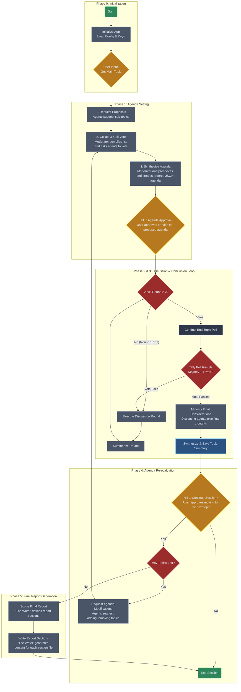

### **Project Specification: Virtual Agora**

Version: 1.1

Date: July 25, 2025

Author: Gemini

#### **1\. Project Overview**

Virtual Agora is a terminal-based application that facilitates structured, multi-agent discussions on complex topics. The system leverages large language models (LLMs) from various providers (Google, OpenAI, Anthropic, Grok) to simulate a deliberative assembly or "Agora."

The core philosophy is to move beyond simple conversational turn-taking. The system introduces a formal process for defining a discussion agenda through agent voting, overseen by a neutral AI Moderator. Key decisions and transitions are gated by Human-in-the-Loop (HITL) approvals, giving the user ultimate control over the discussion's flow. At the conclusion of the session, the system automatically generates a comprehensive, multi-file report synthesizing the entire discussion.

The application is intended for developers, researchers, and strategists who wish to explore multifaceted topics by leveraging the diverse perspectives of different AI models in a structured and repeatable manner.

#### **2\. Core Features**

- **Multi-Provider Agent Pool:** Configure a mix of agents from different providers in a single session.
- **Dedicated AI Moderator:** A non-participating AI agent responsible for facilitating the process, not the content.
- **Democratic Agenda Setting:** Agents propose and vote on sub-topics to create a structured discussion plan.
- **Dynamic Agenda Modification:** After a topic is concluded, agents can propose adding or removing topics before re-voting on the agenda.
- **Human-in-the-Loop Control:** The user must approve the final agenda and give permission to transition between topics.
- **Turn-Based, Rotating Discussion:** Agents comment in a rotating order to ensure fair participation.
- **Relevance Enforcement:** The Moderator enforces on-topic conversation with a "warn-then-mute" mechanism.
- **Stateful Context Summarization:** The Moderator summarizes each round to manage context length and maintain focus.
- **Advanced Topic Conclusion:** A majority + 1 vote is required to close a topic.
- **Minority Dissent Round:** Dissenting voters get a final turn to state their concluding remarks before a topic is closed.
- **Per-Topic Summary Files:** Concluded topics are summarized and saved to individual, human-readable files.
- **Automated Final Report Generation:** At the end of the session, the system generates a structured, multi-file report synthesizing the entire discussion.
- **Persistent Logging:** Every session is logged to a file for analysis and review.
- **Color-Coded Terminal UI:** A rich terminal interface for readability, differentiating between agents and system messages.

#### **3\. System Architecture & Technology Stack**

- **Language:** Python 3.10+
- **Core Framework:** LangGraph will be used to model the stateful, cyclical nature of the application as a graph.
- **LLM Integration:** Official Python SDKs for:
  - Google Gemini (google-generativeai)
  - OpenAI (openai)
  - Anthropic (anthropic)
  - Grok (via its API)
- **Configuration:** PyYAML to parse config.yml.
- **API Key Management:** python-dotenv to load keys from a .env file.
- **Terminal User Interface:** rich library for colored and formatted text output.

#### **4\. Detailed Workflow**

The application flow is a stateful graph managed by LangGraph.

**Phase 0: Initialization**

1. **System Start:** On execution, the application reads the .env file for API keys.
2. **Configuration Loading:** The config.yml file is parsed to instantiate the Moderator and the list of Discussing Agents. Agent names will be created based on the model and an index (e.g., gemini-1.5-pro-1, gpt-4o-1, gpt-4o-2).
3. **Logging Setup:** A new log file is created with a timestamp, e.g., session_2025-07-25_121500.log.
4. **Initial User Prompt:** The system shall prompt the user for the high-level topic of discussion.\[User Input Required\]: Please enter the topic you would like the agents to discuss:

**Phase 1: Agenda Setting**

1. **Topic Proposal Request:** The Moderator sends a request to every discussing agent to propose 3-5 sub-topics based on the user's initial prompt.
2. **Proposal Collation:** The Moderator gathers all responses and compiles a single, unique list of potential sub-topics.
3. **Call for Votes:** The Moderator presents the collated list to the agents and instructs them to vote on their preferred order of discussion. Agents will reply in natural language.
4. **Moderator Synthesis:** The Moderator's LLM is called with all the natural language votes as context. It is prompted to analyze the votes and produce a single, rank-ordered agenda.
   - **Output Format:** The Moderator's final output for this step **must** be a JSON object: {"proposed_agenda": \["Topic C", "Topic A", "Topic B"\]}.
   - **Tie-Breaking:** The Moderator has the authority to break any ties.
5. **Human Agenda Approval (HITL):** The system parses the Moderator's JSON. The ordered agenda is displayed to the user, who is prompted to approve or edit it. The user has final authority.

**Phase 2: Topic Discussion Loop**

1. **Topic Start:** The Moderator announces the first topic from the user-approved agenda.
2. **Round Execution:** The system iterates through the agents in the current turn order (\[A,B,C\] in Round 1, \[B,C,A\] in Round 2, etc.). Each agent receives context and provides its comment.
3. **Relevance Check:** The Moderator reviews the generated response and enforces on-topic discussion with the "warn-then-mute" protocol.
4. **Round Summarization:** After all agents have completed their turn, the Moderator's LLM is called to produce a concise summary of the round.

**Phase 3: Topic Conclusion & Finalization**

1. **End-Topic Poll Trigger:** The poll is initiated at the start of every round, **beginning with the third round**.
2. **Poll & Vote:** The Moderator asks: "Should we conclude the discussion on '\[Current Topic\]'? Please respond with 'Yes' or 'No' and a short justification."
3. **Tally & Decision:** The system tallies the votes. The topic is concluded if Number of 'Yes' votes > (Total number of agents / 2).
   - **If Topic Continues:** The vote fails, and the system proceeds with a normal discussion round (Phase 2).
   - **If Topic Concludes:** The vote passes, and the system proceeds to the next step.
4. **Minority "Final Considerations" Round:** The Moderator identifies agents that voted "No" and prompts them for their final considerations on the topic.
5. **Topic Synthesis & Summary:** The Moderator is prompted to synthesize the _entire discussion_ for the concluded topic into a comprehensive, agent-agnostic text.
6. **Summary File Output:** The system saves this summary to a dedicated Markdown file (e.g., topic_summary_Legal_Status_of_DAOs.md).

**Phase 4: Agenda Re-evaluation**

1. **Human Continuation Approval (HITL):** The user is asked for permission to proceed. The topic '\[Previous Topic\]' is now concluded and its summary has been saved. Shall we re-evaluate the agenda and continue? (y/n)
   - If 'n', the session terminates.
   - If 'y', the process continues.
2. **Call for Agenda Modification:** The Moderator presents the remaining topics and asks all agents: "Based on our last discussion, should we add any new topics to our agenda, or remove any of the remaining ones?"
3. **Return to Agenda Setting:** The system loops back to **Phase 1**. All suggestions are collated and put to a new vote, followed by HITL approval of the newly ranked agenda.

**Phase 5: Final Report Generation**

1. **Trigger:** This phase begins automatically when the last topic on the agenda is concluded and the user approves continuation, but the agenda is now empty.
2. **Report Scoping:** The Moderator, now acting as **"The Writer,"** is prompted to review all saved topic summaries and define a logical structure for a final report, outputting it as a JSON list of section titles.
3. **Section-by-Section Writing:** The system iterates through the report sections, prompting The Writer to generate the content for each one based on the context of all topic summaries.
4. **File Output:** The generated text for each section is saved to a separate, numbered Markdown file (e.g., final_report_01_Executive_Summary.md).
5. **Process Completion:** Once all report files are written, the system displays a final message and terminates.\[System\]: Final report has been generated successfully. Virtual Agora session complete.

#### **5\. Agent Personas & Prompting**

**A. Moderator Agent**

- **Core Prompt:**"You are the impartial Moderator of 'Virtual Agora.' Your role is NOT to have an opinion on the topic. Your sole responsibilities are process-oriented: 1. Facilitate the creation of a discussion agenda by requesting proposals and tallying votes from agents. 2. Announce the current topic and turn order. 3. Ensure all agents' comments are relevant to the current sub-topic. 4. Summarize discussion rounds. 5. Conduct polls to decide when a topic is finished. **If a vote to conclude passes, you MUST offer the dissenting voters a chance for 'final considerations.'** 6. After a topic is fully concluded, you MUST write a comprehensive, agent-agnostic summary of the entire topic discussion. 7. At the end of the entire session, you will act as **The Writer** to analyze all topic summaries and produce a final, multi-file report based on a structure you first define. You must communicate clearly. When a structured output like JSON is required, you must adhere to it strictly."

**B. Discussing Agent**

- **Core Prompt:**"You are a thoughtful participant in a structured discussion. You will be given a topic and context from previous turns. Your goal is to provide a well-reasoned, concise comment that builds upon the conversation. Stay strictly on the topic provided by the Moderator. Be prepared to propose discussion topics, vote on agendas, and vote on when to conclude a topic when asked."

#### **6\. Configuration File (config.yml)**

\# Virtual Agora Configuration File
 \# The Moderator is a dedicated agent responsible for facilitation.
\# A powerful model is recommended for its complex reasoning tasks.
moderator:
provider: Google
model: gemini-1.5-pro
 \# The list of agents that will participate in the discussion.
agents:
\- provider: OpenAI
model: gpt-4o
count: 2 # Creates gpt-4o-1 and gpt-4o-2
 \- provider: Anthropic
model: claude-3-opus-20240229
count: 1
 \- provider: Google
model: gemini-1.5-pro
count: 1
 \- provider: Grok
\# model: &lt;grok_model_name&gt; # Specify Grok's model name here
count: 1

#### **7\. State Management**

- **In-Memory State (LangGraph Object):** A Python dictionary will manage the live state of the application.
- **Persistent State (Log File):** An append-only text file will store the raw transcript of the entire session, with each line prefixed by a timestamp and the speaker's name.

#### **8\. User Interface (Terminal)**

The rich library will be used to style terminal output for clarity.

- **Moderator:** Bold White
- **User Prompts (HITL):** Yellow
- **Agent Group 1 (e.g., OpenAI):** color from pool
- **Agent Group 2 (e.g., Google):** color from pool
- **Agent Group 3 (e.g., Anthropic):** color from pool
- **System Messages/Errors:** Red

#### **9\. Error Handling & Edge Cases**

- **API Failures:** Implement a retry mechanism for transient network errors. If an API call persistently fails, skip the agent's turn and log the error.
- **Missing API Keys:** The application will check for all required keys at startup and exit gracefully with an informative message if any are missing.
- **Malformed Agent Responses:** If an agent fails to adhere to a specific format (e.g., for a Yes/No vote), the Moderator will re-prompt it once before marking the response as invalid.
- **Invalid User Input:** If the user provides invalid input at a HITL gate, the system will re-prompt with valid options.

#### **10\. Future Enhancements**

- **Final Report Compilation:** Add a final step to compile all generated .md report files into a single, formatted PDF document using a tool like pandoc.
- **Web Interface:** Create a Gradio or Streamlit UI for a more user-friendly experience.
- **Vector Database Context:** Replace simple summarization with a vector database (e.g., ChromaDB) for more sophisticated retrieval of relevant long-term context.
- **Agent Personas:** Allow users to assign personas to agents in the config.yml (e.g., persona: "You are a skeptical economist").
- **Save/Load Session State:** Implement functionality to serialize the entire application state to a file, allowing a long discussion to be paused and resumed later.

#### 11. LangGraph Flow Diagram

##### Diagram Legend & Explanation

- Rectangles (Blue-Gray): These are Process Nodes. They represent actions taken by the system or the AI agents, such as proposing topics, summarizing a round, or writing a report file.
- Diamonds (Red): These are Decision Nodes. They represent conditional logic where the graph's path will branch, such as checking the round number or tallying poll results.
- User Input Rectangles (Gold): These are Human-in-the-Loop (HITL) Nodes. The application pauses at these points and requires direct input from the human user to proceed.
- File Output Rectangle (Dark Blue): This node specifically highlights where a persistent file (the topic summary) is written to disk.
- Rounded Rectangles (Green): These represent the Start and End states of the application.

##### How to Read the Flow

1. The process begins at Start and flows linearly through Phase 0 and Phase 1 to establish the initial, user-approved agenda.
1. The main loop for discussing a single topic occurs within the Phase 2 & 3 subgraph. Note the internal loop: a round is executed and summarized. At the start of the third round, the system begins polling to see if the topic should conclude. If the vote fails, it loops back into another discussion round.
1. If a topic conclusion vote passes, the flow moves to the "Minority Final Considerations" round and then saves the topic summary file.
1. The system then enters Phase 4, where the user must approve continuing. If they do, the system checks if any topics remain.
1. If topics remain, agents are asked to modify the agenda, and the flow jumps all the way back to Phase 1 to re-vote on a new agenda.
1. If no topics remain, the process moves to the final Phase 5.
1. Phase 5 is a linear process that scopes, writes, and saves the final multi-file report before gracefully ending the session.
